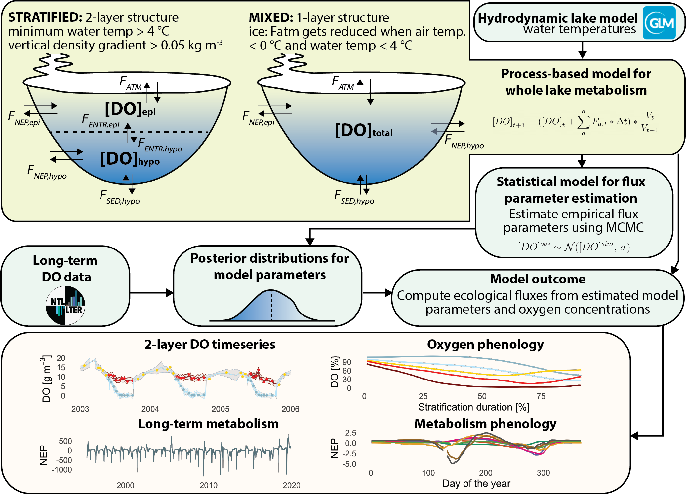

# metabolism_phenology
Scripts, model configurations and outputs to process the data and recreate the figures from Ladwig, R., Appling, A., Delany, A., Dugan, H.A., Gao, L., Lottig, N., Stachelek, J., Hanson, P.C.: Long-term Change in Metabolism Phenology in North-Temperate Lakes.

This repository includes the setup and output from the metabolism model ran on the lakes Allequash, Big Muskellunge, Crystal, Fish, Mendota, Monona, Sparkling and Trout. Scripts to run the model are located under /src (odem_min_indexed.stan, run_odem_chtc.R, stan_utility.R, stan_utility_chtc.R) together with the scripts to create the driver data, 0_Model_Input.R, and the processed results for the discussion of the paper, 1_Postprocessing.R. Addtionally, all scripts to recreate the figures from the manuscript are also included in /src.

The figures are located under /Figures and processed output under /Processed_Output.

<!-- -->
